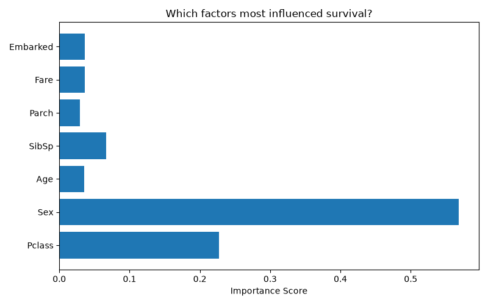

# Titanic Survival Prediction 🚢

A machine learning project that predicts whether a passenger survived the Titanic disaster using XGBoost.

## Results
- **Accuracy: 80.45%**
- Most important survival factor: **Sex** (women survived at much higher rates)
- Second most important: **Ticket Class** (first class had better lifeboat access)
- 

## What I did
- Loaded and explored the Titanic dataset (891 passengers)
- Cleaned missing data (Age, Cabin, Embarked)
- Converted text columns to numbers for ML processing
- Trained an XGBoost classifier on 80% of the data
- Tested on the remaining 20% — achieved 80.45% accuracy
- Visualized which features influenced survival most

## Tech Stack
- Python
- Pandas
- XGBoost
- Scikit-learn
- Matplotlib
- Jupyter Notebook

## What I learned
- End to end ML workflow: data cleaning → feature engineering → model training → evaluation
- How XGBoost works and why it outperforms simple decision trees
- Feature importance analysis to interpret model decisions